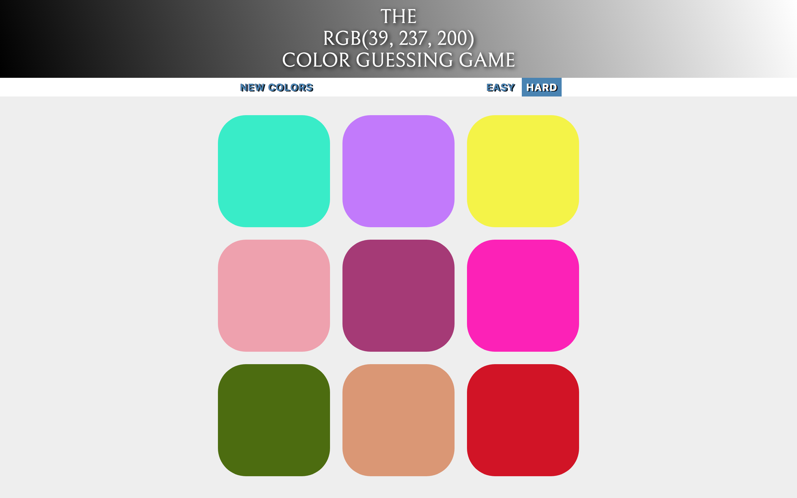
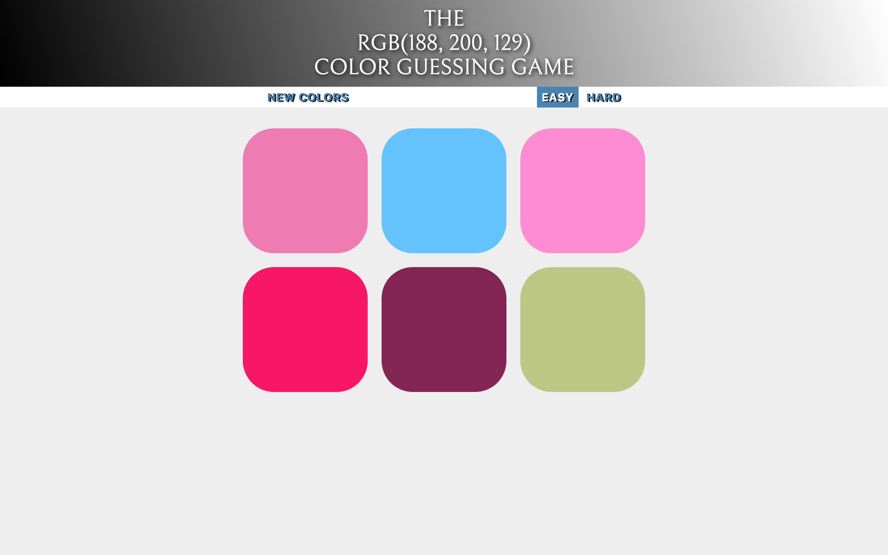

# RGB-Color-Guessing-Game
Cool interactive RGB color guessing game

## Prerequisites
Yarn or npm

## Getting Started
Download the files, run npm or yarn install, it will install the dependencies. Once dependencies are installed run gulp watch to start browserify,you can then make changes to files in src and see the compiled code in dist files

## Screenshots
 

## How to play?
See the color and try to guess the block which displays the color. Hard mode has 9 blocks where as easy mode has just 6 blocks.

## Built with
  - [Gulp.js](https://gulpjs.com/) - The task manager
  - [Yarn](https://yarnpkg.com/en/) - The package manager
  - [Webpack](https://webpack.js.org/) - The module bundler
  - [Babel](https://webpack.js.org/) - The compiler to write latest JavaScript
